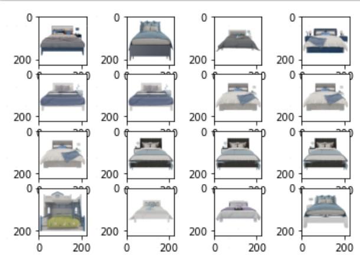

#### 相似图片搜索 
功能区分类准确率: 0.985
#### 损失函数
##### triple-loss label-smooth center-loss 等等
##### 说明: (无法提供数据集；数据集是属于公司的，仅仅将训练代码以及测试效果给出)
##### 修改了 torch-keras 的代码
##### todo 增加其它维度的损失函数 是否更好 ?
##### 训练 
nohup python group_match_main.py > train.log 2>&1 &
##### 使用过程当中 使用欧式距离
##### 实际使用过程当中发现数据标签存在很多问题 会导致训练有一些问题
##### 下面是相似的示例 (按照欧式距离排序)
###### 搜索目标

##### 相似 top16

##### 非相似 16

###### 搜索目标

##### 相似 top16

##### 非相似 16

